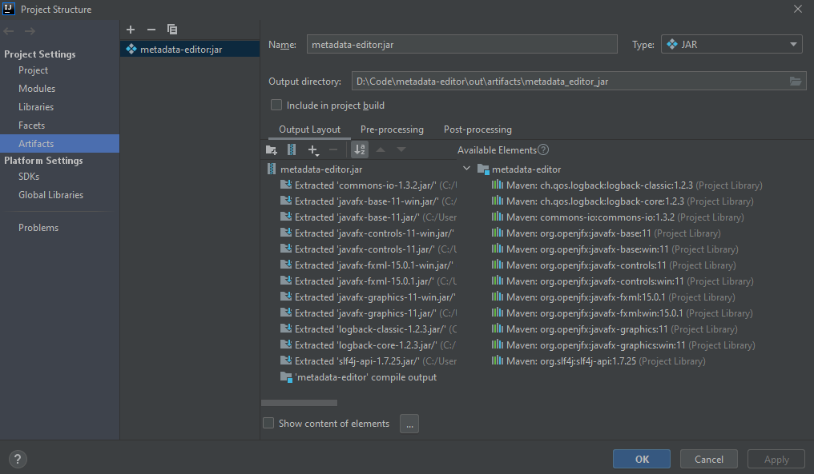

# Metadata editor
The aim of this application is to add custom metadata to files, in order to make it easy to search files by these metadata.
For example if you store pictures, music, movies, etc. on your computer, you may want to keep them in order, but sometimes you can't create the convenient folder structure for that. 
You may keep pictures in folders, by years, or by categories, such as family, friends, etc. 
But then, what do you do, if you want to tag some picture, such as funny, Johnny, sunset, myself, favourite. 
This makes this app handy, because with this, you can put these tags as metadata to those pictures, and then you can easily find them. 

## Packaging and running
For packaging IntelliJ can be used.
The following image shows the setup.

After that, `Build -> Build Artifacts... -> Build` will create the runnable jar. 
To run the application, unfortunately, you can't just double click the icon.
You have to run from commandline, furthermore, you have to provide it additional parameters.

`java --module-path path_to_javafx_lib_folder --add-modules javafx.controls,javafx.fxml,javafx.graphics -jar name_of_the_file.jar`

It is practical to save this (with the proper modification) into a script file, on Windows to .bat file, on Linus to an .sh file. 